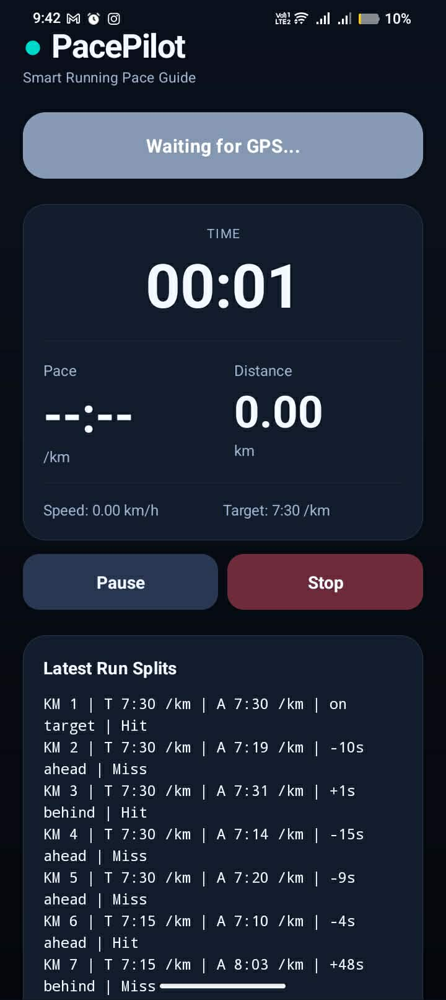
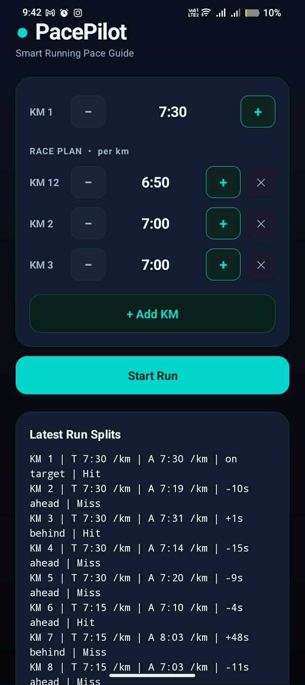

# PacePilot — GPS Running Pace Tracker

An Android running tracker built to solve one specific problem: staying on target pace during a run, not just measuring it after. Real-time GPS tracking with per-kilometer pace targets, voice coaching, and vibration feedback — all without ads, accounts, or subscriptions.

## Screenshots

 

## Features

**Pace Planning**
- Set a base target pace for your run
- Override pace targets per kilometer (e.g., km 1-3 at 6:00, km 4-6 at 5:30)
- Pace plan persists across sessions — no re-entering every run

**Real-Time Feedback**
- Live pace, distance, speed, and elapsed time (moving time only, pauses excluded)
- Vibration feedback when too fast or too slow — distinct patterns for each
- Voice coaching via TTS: announces current pace, target delta, and next km target at each kilometer marker

**GPS & Location**
- High-accuracy GPS via FusedLocationProviderClient
- Fast signal warmup: seeds from last known location on start
- Foreground service keeps tracking alive with screen off

**Run History**
- Saves completed runs with full km split data (target vs actual pace per km)
- View past runs with distance, duration, average pace, and per-km breakdown

## Tech Stack

- **Language:** Kotlin
- **UI:** All UI built in code — no XML layouts, no Jetpack Compose
- **Architecture:** Single Activity + Foreground Service (`LocationService`)
- **Location:** Google Play Services FusedLocationProviderClient
- **TTS:** Android TextToSpeech API
- **Storage:** Custom JSON persistence (no Room, no Firebase)
- **Min SDK:** 26 (Android 8.0) | Target SDK: 35

## Project Structure

```
app/src/main/java/com/example/runningpace/
├── MainActivity.kt        — UI, controls, run history display
├── LocationService.kt     — Foreground service: GPS tracking, pace feedback, TTS
├── PaceCalculator.kt      — Distance/pace/speed computation from GPS locations
└── RunHistoryStore.kt     — Persist and retrieve run records (JSON)
```

## Building

1. Clone the repo
2. Open in Android Studio
3. Connect a device or start an emulator (API 26+)
4. Run the app — no API keys or config required

> GPS features require `ACCESS_FINE_LOCATION` permission. Grant on first launch.
